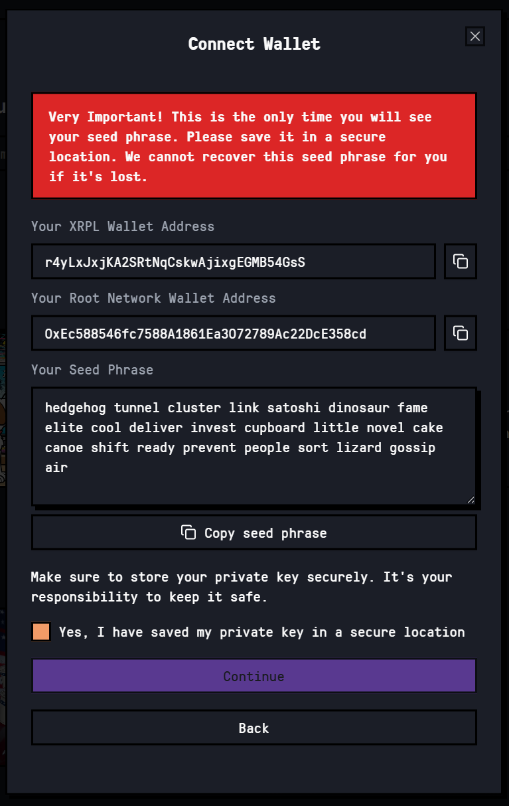

# Wallet Setup

Create a new wallet or import an existing wallet created on aigent.run or First Ledger.

<figure><figcaption></figcaption></figure>

2. Save your private key in a safe place.

<figure><figcaption></figcaption></figure>

3. Create a secure pin.

<figure><figcaption></figcaption></figure>

4. Unlock wallet with your secure pin.

<figure><figcaption></figcaption></figure>

5. Set your profile name.

<figure><figcaption></figcaption></figure>

6. You now have a wallet on both the XRP Ledger and The Root Network. Keep your seed safe.\
   Use XRP on the XRPL or, use XRP or ROOT on TRN and begin trading.

<figure><figcaption></figcaption></figure>

**Warning:** Aigent.run is designed as a hot wallet and is not intended for long-term fund storage. Use the in-app bridging and transfer options to securely withdraw funds as needed.
